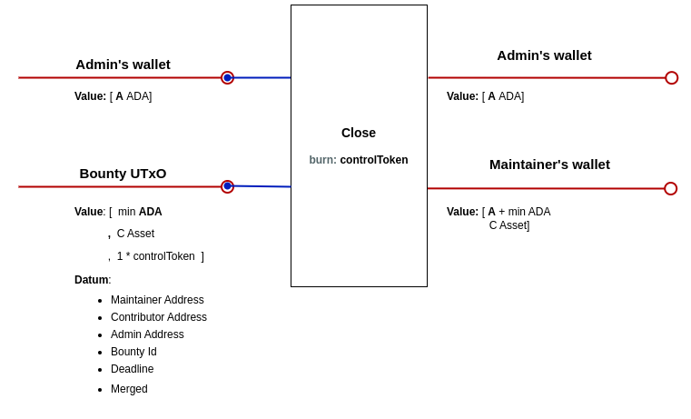

# GitHoney dApp Design

## Introduction

This document describes the technical design of the GitHoney dApp - the script UTxOs involved, the operations that take place during the bounty lifecycle, and the necessary validators and minting policies.

There will be a single `BountyUtxo` for each bounty, which will hold the reward assets deposited by the maintainers. A `ControlToken` will be minted and held in the `BountyUtxo` until a contributor is assigned to the bounty, at which point their `PaymentPubKeyHash` will be added to the datum. The `ControlToken` ensures the correctness of the `BountyUtxo` datum.

## UTxOs specification

### BountyUtxo:

> #### Address
>
> - Parameterized on the `GitHoneyAddress` and `Policy id`.
>
> #### Datum
>
> - maintainer: **PaymentPubKeyHash**
> - deadline: **POSIXTime**
> - bounty_id: **String**
> - admin: **PaymentPubKeyHash**
> - merged: **Bool**
> - contributor: **Optional( PaymentPubKeyHash )** (if assigned)
>
> #### Value
>
> - minAda
> - reward_assets: **MultiAsset**
> - `ControlToken`

## Transactions

### Create BountyUtxo:

This transaction creates a `BountyUtxo` locking the reward assets and minting a `ControlToken`. It sets the maintainer, deadline, bounty_id, admin, and merged (False) in the datum.

### Add Reward:

Adds additional reward assets to an existing `BountyUtxo`.

### Assign Contributor:

Sets the contributor's `PaymentPubKeyHash` to the `BountyUtxo` datum.

### Close Bounty:

Returns the all the assets to the maintainer and burns the `ControlToken`.

### Merge Bounty:

Pays to Githoney the reward assets times `BountyRewardFee`. Updates the merged field to True.

### Claim Bounty:

Pays the contributor the remaining reward assets and burns the `ControlToken`.

## Validators & Minting Policies

### BountyValidator:

- Params: `PolicyID`, `GithoneyAddress`.

#### _AddReward Redeemer_

- The `deadline` has not been reached.
- `BountyUtxo` output value includes input value plus additional reward assets.
- Datum doesn't change.

#### _AssignContributor Redeemer_

- The `deadline` has not been reached.
- The `contributor` field in the datum is null.
- Contributor's `PaymentPubKeyHash` is added to the `BountyUtxo` datum.
- Utxo assets are the same plus min ADAs payed by the `contributor`.

#### _CloseBounty Redeemer_

- `BountyUtxo` input.
- `ControlToken` is burnt.
- Reward assets and the min ADAs are paid back to the maintainer.
- Datum Admin address is present in the signers.

#### _MergeBounty Redeemer_

- `BountyUtxo` input.
- The merged field is False.
- The `deadline` has not been reached.
- Reward assets times `BountyRewardFee` are paid to the `GitHoneyAddress`, the min ADAs are paid back to the mantainer, and the rest of the assets remain in the utxo.
- Datum Admin address is present in the signers.
- Datum merged field is updated to True.

#### _ClaimBounty Redeemer_

- `BountyUtxo` input
- The merged field is True.
- `ControlToken` is burnt.
- Remaining reward assets in utxo are payed to the `contributor`'s `PaymentPubKeyHash`.

### mintingPolicy:

- Params: `BountyCreationFee`, `BountyRewardFee`, `BountyValidatorAddress`, `GitHoneyAddress`.

#### MINT:

- A single `ControlToken` is minted.
- The minted token and the min ADAs are paid to the `BountyValidatorAddress`.
- The datum of the `BountyUtxo` is checked for correctness:
  - Deadline must be in the future.
  - Merged field must be False.
  - Bounty Reward Fee must be equal or grater than 0 and less than 1.

#### BURN:

- No restrictions.
