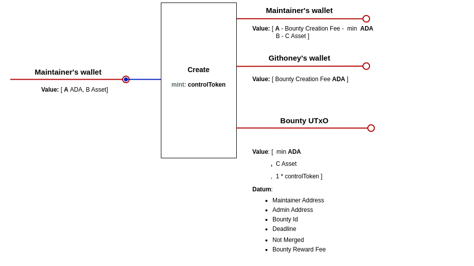
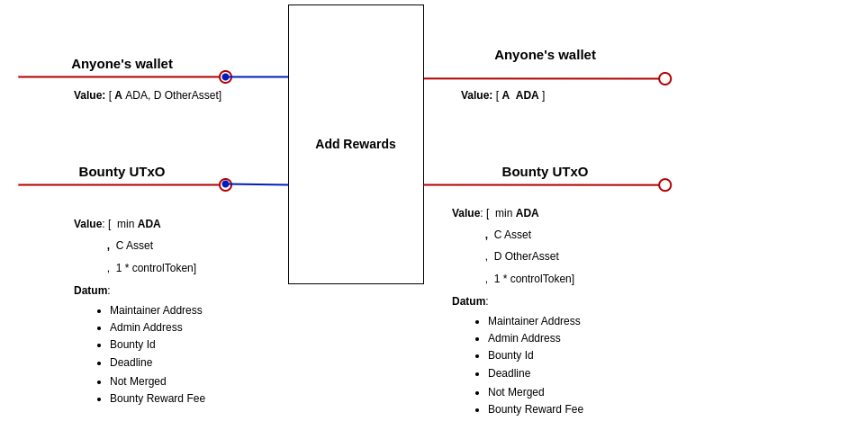
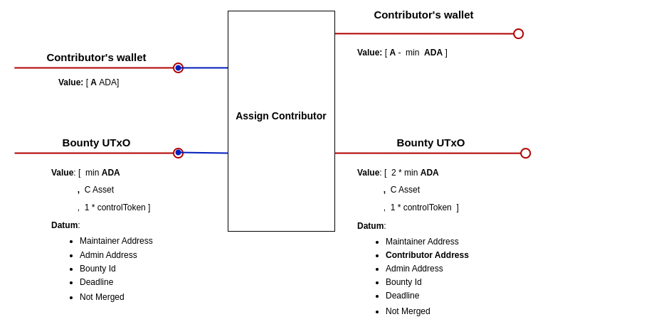
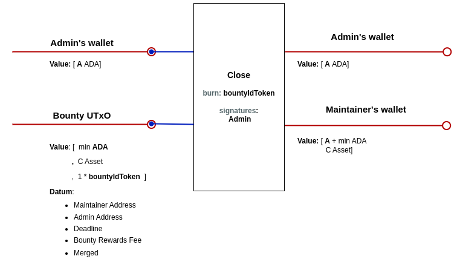
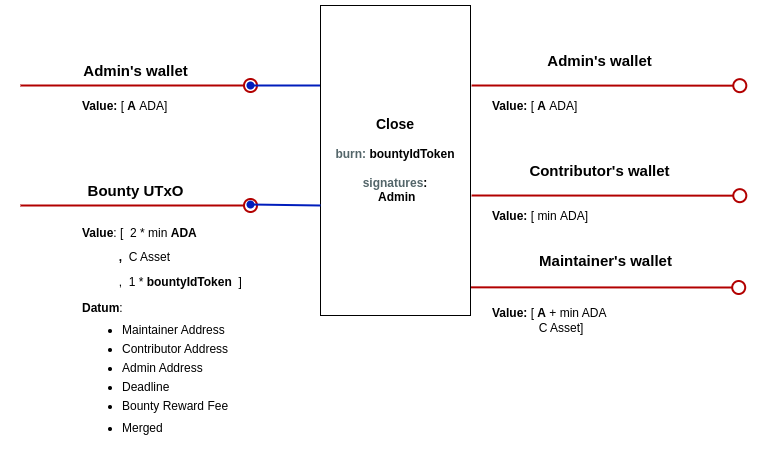
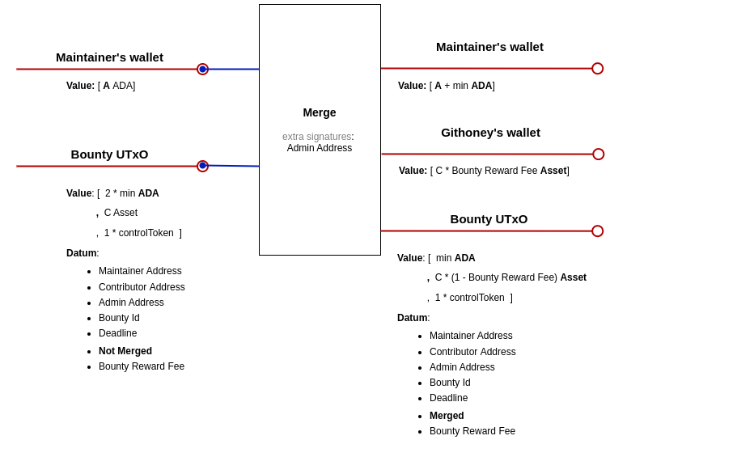
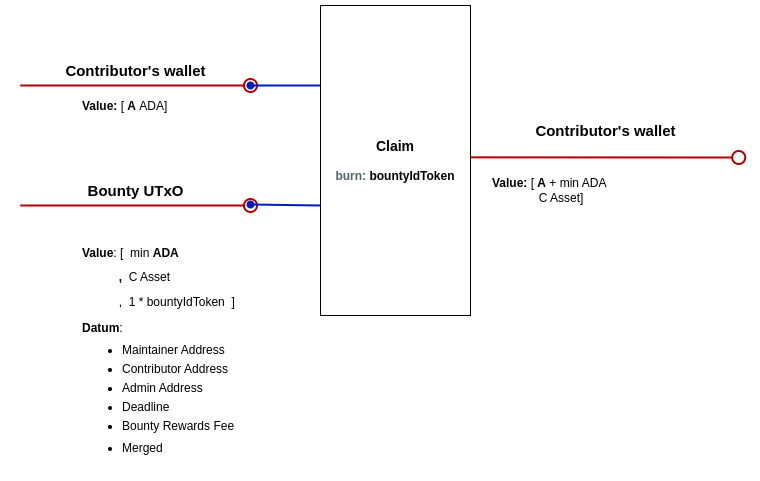

# GitHoney dApp Design

## Introduction

This document describes the technical design of the GitHoney dApp - the script UTxOs involved, the operations that take place during the bounty lifecycle, and the necessary validators and minting policies.

There will be a single `BountyUtxo` for each bounty, holding the reward assets deposited by the maintainers. A `ControlToken` will be minted and held in the `BountyUtxo` during the bounty creation. Initially, the contributor field in the datum will be null until a developer decides to work on that bounty, at which point their `PaymentPubKeyHash` will be added to the datum. The `ControlToken` ensures the correctness of the `BountyUtxo` datum, the initial payment of the bounty creation fee to GitHoney, and also that the reward assets are not null. The presence of the `ControlToken` within a UTxO held at the validator address will serve as proof that the UTxO is a `BountyUtxo`.  
**Multivalidators** will be utilized in the implementation, which is why both scripts share the same parameters. Consequently, the script address and the minting policy ID are identical. This enables us to identify the policy ID of the `ControlToken` within the validator and the validator address within the minting policy.

## UTxOs Specification

### BountyUtxo

> #### Address
>
> - Parameterized on the `GitHoneyAddress`, `BountyCreationFee`, and `BountyRewardFee`.
>
> #### Datum
>
> - maintainer: **PaymentPubKeyHash**
> - admin: **PaymentPubKeyHash**
> - contributor: **Optional(PaymentPubKeyHash)** (if assigned)
> - deadline: **POSIXTime**
> - bounty_id: **String**
> - merged: **Bool**
>
> #### Value
>
> - minAda
> - reward_assets
> - `ControlToken`

## Transactions

### Create BountyUtxo

This transaction creates a `BountyUtxo` locking the reward assets plus min ADA and a `ControlToken`. It sets the maintainer, deadline, bounty_id, admin, and merged (False) in the datum.

### Add Reward

Adds additional reward assets to an existing `BountyUtxo`.

### Assign Contributor

Sets the contributor's `PaymentPubKeyHash` to the `BountyUtxo` datum and adds the contributor's min ADA to the value.

### Close Bounty Before Contributor Assignment

Returns all the assets to the maintainer and burns the `ControlToken`.

### Close Bounty After Contributor Assignment

Returns the reward assets to the maintainer, burns the `ControlToken` and returns the min ADA to the contributor.

### Merge Bounty

Pays GitHoney the reward assets times `BountyRewardFee`. Updates the merged field to True. The contributor's min ADAs remain in the UTxO.

### Claim Bounty

Pays the contributor the remaining reward assets and burns the `ControlToken`.

## Validators & Minting Policies

### BountyValidator

- Params: `GitHoneyAddress`, `BountyCreationFee`, and `BountyRewardFee`.

#### _AddReward Redeemer_

- `BountyUtxo` input with a control token.
- The `deadline` has not been reached.
- `BountyUtxo` output value includes the input value plus additional reward assets.
- Datum doesn't change.

#### _AssignContributor Redeemer_

- `BountyUtxo` input with a control token.
- The `deadline` has not been reached.
- The `contributor` field in the datum is null.
- Contributor's `PaymentPubKeyHash` is added to the `BountyUtxo` datum, and the rest of the datum fields are the same.
- UTxO assets are the same plus min ADAs.

#### _CloseBounty Redeemer_

- `BountyUtxo` input with a control token.
- `ControlToken` is burnt.
- Reward assets and the min ADAs are paid back to the maintainer.
- If the `contributor` is setted the min ADAs are paid back to the contributor.
- Datum Admin address signed the transaction.

#### _MergeBounty Redeemer_

- `BountyUtxo` input with a control token.
- The merged field is False.
- The `deadline` has not passed.
- Reward assets times `BountyRewardFee` is paid to the `GitHoneyAddress`, the min ADAs are paid back to the maintainer, and the rest of the assets remain in the UTxO.
- Datum Admin address signed the transaction.
- Datum merged field is updated to True, and the rest of the datum fields are the same.

#### _ClaimBounty Redeemer_

- `BountyUtxo` input with a control token.
- The merged field is True.
- `ControlToken` is burnt.
- The remaining reward assets in UTxO are paid to the `contributor`'s `PaymentPubKeyHash`.

### mintingPolicy

- Params: `BountyCreationFee`, `BountyRewardFee`, `GitHoneyAddress`.

#### MINT

- A single `ControlToken` is minted.
- The minted token and the min ADAs are paid to the `BountyValidatorAddress`.
- There are some reward assets paid to the `BountyUtxo`.
- The datum of the `BountyUtxo` is checked for correctness:
- Deadline must be in the future.
- Merged field must be False.
- Contributor field must be null.

#### BURN

- No restrictions.
